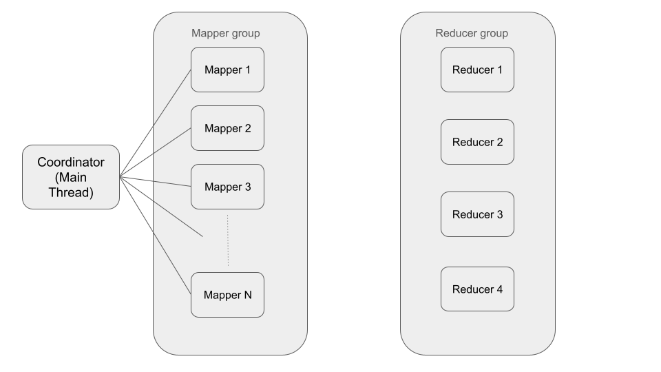
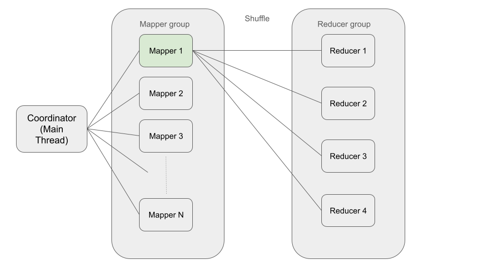
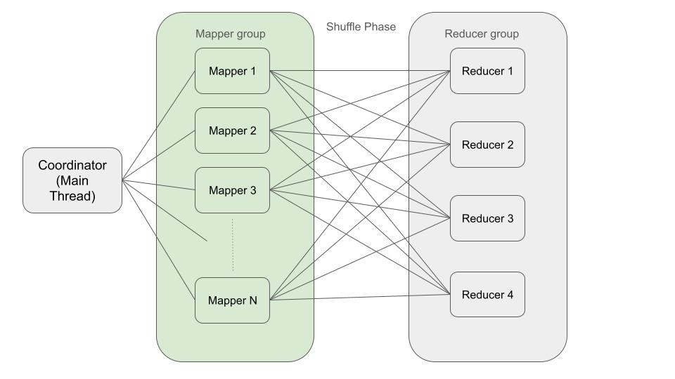
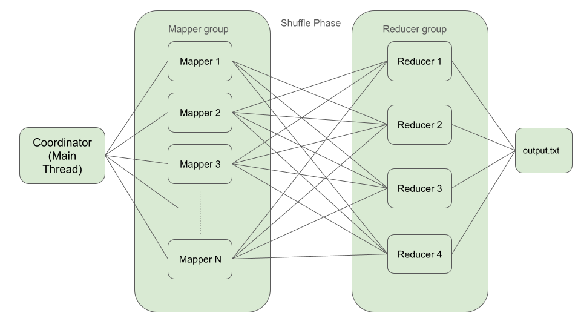

# Go Multi-Threaded Single Machine MapReduce Framework


## Overview
This project provides a basic implementation of a multi-threaded MapReduce framework in a single Golang process using Golang Threads (goroutines). The goal of this project is to simulate a typical clustered algorithm on a single machine, similating each machine using a thread, and networking (mappers to reducers) through Go Channels. 


## Features
- **Multi-Threaded Processing:** Utilizes goroutines in Go for concurrent execution of mapping and reducing tasks.
- **Configurable:** Allows users to specify the number of reducers and customize the buffer size for communication channels.
- **Flexible Implementation:** Users can define their own mapping and reducing logic based on the specific requirements of their MapReduce application.


## Usage

### Single Threaded
1. **Instantiate MultiThreadedMR:**
    ```go
    mr := NewMultiThreadedMR([]string{"file1.txt", "file2.txt", "file3.txt"})
    ```

2. **Process Data:**
    ```go
    mr.Process()
    ```

3. **Implement Custom Logic:**
   - Fill in the `mapper` and `reduceFunction` methods with application-specific mapping and reducing logic.

4. **Results:**
   - The final aggregated result can be obtained based on the user-defined logic in the `reduceFunction`.


### Multithreaded
1. **Instantiate MultiThreadedMR:**
    ```go
    mr := NewMultiThreadedMR([]string{"file1.txt", "file2.txt", "file3.txt"})
    ```

2. **Process Data:**
    ```go
    mr.Process()
    ```

3. **Implement Custom Logic:**
   - Fill in the `mapper` and `reduceFunction` methods with application-specific mapping and reducing logic.

4. **Results:**
   - The final aggregated result can be obtained based on the user-defined logic in the `reduceFunction`.


## Example
```go
package main

import (
	"fmt"
	"github.com/cakuang1/MultiThreadedMapReduce"
)

func main() {
	// Example usage
	mr := MultiThreadedMapReduce.NewMultiThreadedMR([]string{"file1.txt", "file2.txt", "file3.txt"})
	mr.Process()
	fmt.Println("Processing completed.")
}
```


## Docker 


# How this works
Typical multi-threaded processing framework with master-worker pattern 

## Mapping phase

 Master thread distributes tasks and maintains status and overall process. For each input file,the main thread spawns worker threads to handle processing. Each mapper is responsible for outputting a set of key-value pairs.
 During this phase, the main thread also spawns a pre determined number of reducer nodes in the background.



Instead of waiting for all mappers to finish before moving on to the reducing phase, mappers start sending KV pairs to reducers when they are finished. The simulation of communicating between mappers and reducers in a distributed enviornment is done by providing Golang channels between threads which allow threads to communicate. 

### Shuffle phase *

A tiny phase that deals with distributing the KV pairs by hashing. Maps know where to send their KV pairs by hashing and taking the mod of hash value by the number of reducers. After the hash is calculated, the KV pair is sent over to a buffered Golang channel, which allows data to stay in the channel until its processed, similar to a message queue.




 ## Reduce Phase 
Each mapper thread notifies the main thread when done processing by deleting themselves from the waitgroup. After all mappers are done processing, all threads are released. As stated above, the reduce phase begins  



Output is achieved 




